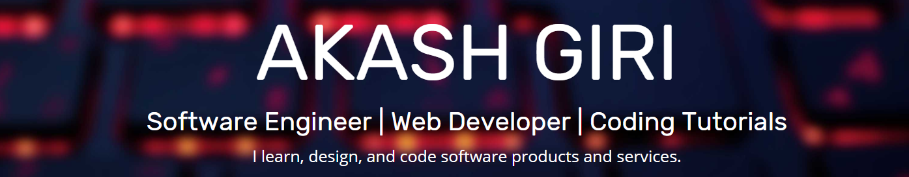

### Hi there 👋

It's Akash. I'm a software developer engineer @zeliot. I'm mainly working on full stack development and helping build awesome software.

I like to share the knowledge that I've gained through my professional and personal experience in software development via blog posts and video tutorials. I occasionally contribute to open-source. It helps me keep up to date with programming and development.

- 💬 Ask me about: web development and software engineering in general
- 📫 How to reach me: [akashgiri.com](akashgiri.com)
- ⚡ Fun fact: Sky is not blue.
  ​ 
     
